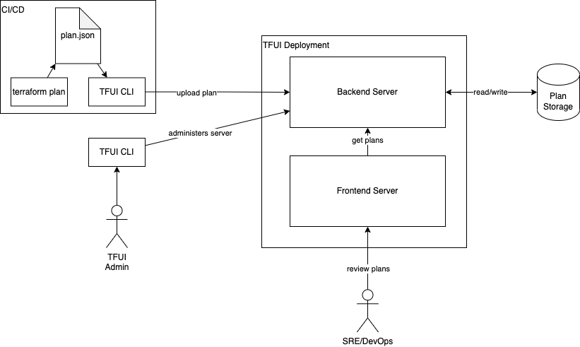

# TFUI

`tfui` is a server and command line client to review [Hashicorp Terraform](https://www.terraform.io/) plans in a succinct manner.
Plans can be uploaded with a CLI and seen on a browser.

## Usage

### Server

Environment variables available are:

-`APPLICATION_TOKEN` to authenticate to the API (default: not set)
-`BASE_DIR` as the directory of the plan file storage (default: `./plans`)
-`PORT` for which port the application should run on (default: `8080`)

```bash
tfui server
```

### Client

```bash
tfui is a tool to manage the Terraform UI server, e.g. upload plans, or reset the server.

Usage:
  tfui [command]

Available Commands:
  completion  Generate the autocompletion script for the specified shell
  config      Manages local config
  help        Help about any command
  plan        Commands to manage the Terraform plans
  server      Start the server
  system      Commands to manage the system

Flags:
  -h, --help      help for tfui
  -v, --version   version for tfui

Use "tfui [command] --help" for more information about a command.
```

### Integrating into CI/CD workflow

Requirements:

1. The environment variables `REGION`, `PROJECT` and `WORKSPACE` have to be set.
2. The upload must run from a directory within a Git repository, so that the current commit hash can be parsed and added to the plan's meta information.

```bash
terraform plan -out infra.tfplan
terraform show -json infra.tfplan > infraplan.json
tfui plan upload -f infraplan.json
```

## Developing, building & running

### Make Targets

| Make Target    | Description                                          |
|----------------|------------------------------------------------------|
| `build`        | Build the binary                                     |
| `format`       | Auto-format the code to conform with common Go style |
| `lint`         | Run the linter to enforce best practices             |
| `test`         | Run all tests                                        |
| `docker-build` | Build docker container                               |
| `docker-run`   | Run docker container                                 |
| `helm-deploy`  | Deploys the Helm chart into a K8s cluster            |

### Architecture


